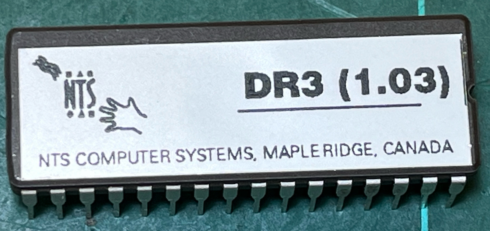

The ROMs are 512KB in size and so require a 27C040 EPROM. 

# NTS_325_DR3_1.03
Earlier ROM version that has a typing tutor but no BASIC implementation. 
- Diagnostic 1.03.27  (960523)  by NER

# NTS_325_2.00
Upgraded ROM that includes BASIC. 
- Diagnostic 1.04 (930402)  by NER
